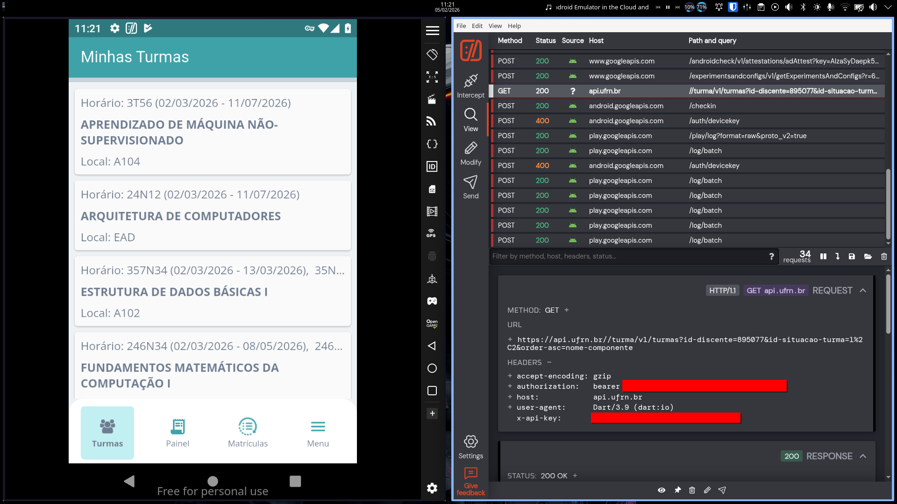
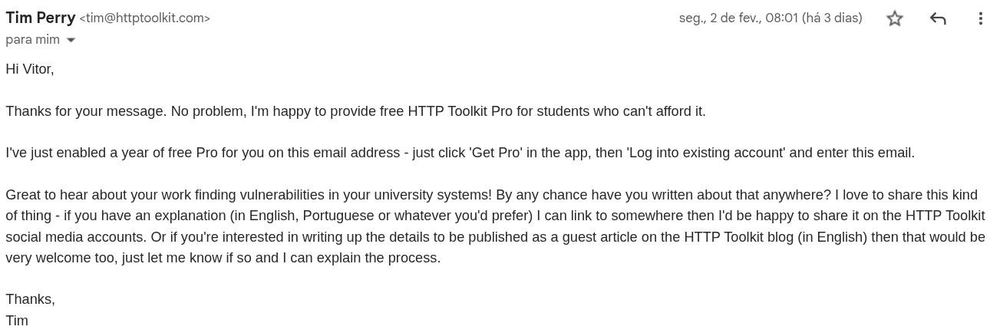

# Introdução

No momento em que escrevo esta publicação, estou indo para o 3º período do Bacharelado em Tecnologia da Informação na Universidade Federal do Rio Grande do Norte (UFRN). E sim, é isso mesmo que você leu no título. Mas calma, não se preocupe: os dados de todo mundo estão protegidos e nada foi vazado. Deixe-me contar melhor como tudo isso aconteceu.

O sistema de gestão acadêmica utilizado pela UFRN é o **SIGAA** (Sistema Integrado de Gestão de Atividades Acadêmicas), desenvolvido aqui pela Superintendência de Tecnologia da Informação (STI) da universidade. Ele é amplamente utilizado por dezenas de instituições em todo o Brasil, incluindo outras universidades federais (UnB, UFC, UFPB, UFPI), universidades estaduais e institutos federais. Não tenho números exatos, mas o total de usuários, somando todas as instituições, pode ultrapassar 1 milhão.

A STI/UFRN mantém uma API que permite interagir com dados do SIGAA e de outros sistemas. Essa API é de uso restrito e, normalmente, é necessário um processo formal para obter credenciais. Um dos clientes dessa API é o **SIGAA Mobile**, um app nativo com interface simples que permite aos alunos acessarem notas, horários e notícias.

# A Curiosidade Matou o Gato? (Quase)

Como estudante de TI, sou naturalmente curioso sobre o funcionamento das coisas e gosto de criar ferramentas que facilitem a vida. No ensino médio (IFRN), ajudei a criar um aplicativo ([App Save](https://www.instagram.com/app.save/)) que resolvia a falta de uma interface mobile decente para o sistema de lá.

Eu tinha planos de fazer algo parecido para a UFRN, talvez um chatbot com IA para consultar notas e outras informações. Como eu não sabia da existência da API naquele momento (e mesmo se soubesse não teria as credenciais), resolvi fazer engenharia reversa para entender como o **SIGAA Mobile** funcionava. Instalei o app no emulador Android [Genymotion](https://www.genymotion.com) e utilizei o [HTTP Toolkit](https://httptoolkit.com) para inspecionar as requisições (man-in-the-middle) e entender o tráfego de dados. Tudo isso em um ambiente controlado, usando apenas minha própria conta.

Ao inspecionar o tráfego, descobri os a existência da API, e consegui encontrar a documentação. A partir daí, comecei a estudar como ela se comportava: testei extensivamente vários endpoints para ver quais dados retornavam e quais eram os limites de validação (também testei inputs como `9999999999`, `0` e `-1` só para ver se o que acontecia 🙃).

A API é complexa — possui centenas de endpoints. O fluxo de dados é fragmentado: para começar, eu precisava primeiro pegar meu `id_usuario`, depois listar meus `vinculos` (graduação, mestrado, etc.), selecionar o vínculo ativo e só então chamar os enpoints que eu queria (notas, turmas, etc).

Muitos endpoints retornavam acesso negado, outros traziam apenas dados públicos. Mas eu continuei "cutucando".

# O Momento "Eita..."

Em certo momento, me deparei com um endpoint relacionado a busca de "usuários". Resolvi testar, esperando receber um erro de permissão.

Quando executei a requisição, veio a surpresa: a API retornou o objeto JSON completo contendo **nome, CPF e e-mail pessoal** de usuários cadastrados no sistema. Isso incluía não apenas alunos, mas provavelmente professores e servidores.

Fiquei em choque. Cheguei a cogitar se aqueles dados seriam públicos por alguma lei de transparência, mas pesquisei e vi que, à luz da **LGPD**, aquilo era uma exposição crítica. Essa falha figura no topo da lista de problemas de segurança mais comuns da [OWASP Top 10 de 2025](https://owasp.org/Top10/2021/A01_2021-Broken_Access_Control/).

Não explorei a fundo para não coletar dados indevidos, mas o potencial de extração era massivo, abrangendo registros de décadas.

Naquele momento, o medo bateu. "Será que serei processado?", "Será se foi errado eu ter explorado o sistema dessa maneira?". Mas a ética falou mais alto: eu precisava reportar aquilo antes que alguém mal-intencionado descobrisse.

# Responsible Disclosure (Divulgação Responsável)

Imediatamente interrompi os testes e redigi um relatório técnico. Enviei um e-mail para a STI detalhando a vulnerabilidade, o passo a passo para reprodução e o impacto (exposição de CPF/E-mails), deixando claro que **não realizei extração de dados de terceiros**, apenas a validação da falha.

A resposta foi exemplar.

A equipe da STI entrou em contato comigo no mesmo dia. Tive uma reunião com a diretoria, onde expliquei o ocorrido. Recebi agradecimentos pela postura ética e profissional. Fui convidado a participar de processos seletivos para bolsas para me juntar à equipe e mantivemos o acordo de que eu só falaria publicamente sobre isso após a correção.

O _patch_ de segurança foi aplicado poucos dias depois, corrigindo as permissões de acesso nos endpoints afetados.

# Conclusão

Fiquei muito feliz com o desfecho. A STI demonstrou ser uma equipe madura e profissional, e fico honrado em ter contribuído — mesmo que acidentalmente — para a segurança dos dados de toda a comunidade acadêmica da UFRN.

Essa experiência reforçou para mim que, agir com ética e responsabilidade, mesmo em situações delicadas, é sempre o melhor caminho.

<!--
Além disso, tive uma conversa com o criador do HTTP Toolkit. É uma ferramenta open source incrível, que me permitiu fazer o que fiz. Ela possui uma versão PRO com alguns recursos extras. Resolvi mandar um e-mail para o criador, explicando que eu sou estudante e como usei a ferramenta, e perguntei se seria possível obter uma licença da versão PRO gratuitamente; ele, de muito bom grado, aceitou.

Ele também me convidou para escrever uma postagem para o blog do HTTP Toolkit falando sobre isso. Esse post deve sair nos próximos dias.
-->
